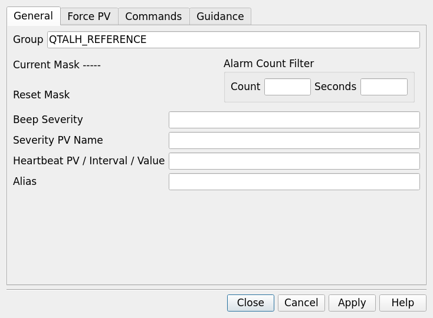

# QtALH appearance

## Optional modern styling

The default remains the Motif-influenced appearance described below. Use
`qtalh -style fusion -mainwindow facility.alhConfig` for modern styling, or add
`-c` for the configuration editor. `-style motif` explicitly restores the default.
Both `-style name` and `-style=name` are accepted; names are case-insensitive and
the last occurrence wins. Installed Qt Widgets styles are supported; Fusion is
the portable recommendation for Qt 5.15 and Qt 6 on Linux, macOS, and Windows.

Styled mode retains the two alarm panes and content-sized rows. It uses styled
buttons, disclosure indicators, focus/selection feedback, a standard splitter
and width slider, and separate Status and Alarm sound sections. Alarm legend
starts collapsed. Alarm colors and severity letters remain visible on both light
and dark palettes; normal surfaces use the selected style and system palette.
Fonts and row hit targets scale together. No widgets are allocated per alarm row.

Styled fonts default to one point smaller than the system font sizes (with a
minimum of 6 points). An explicitly configured runtime-button font keeps its
requested size. With any explicit style other than Motif, **Ctrl+-** decreases the font size,
**Ctrl++** (or **Ctrl+=**) increases it, and **Ctrl+0** restores the startup size.
Use **Command** instead of Ctrl on macOS. Each press changes the size by one
point, with a UI range of 6–72 points. Changes apply throughout the process,
including open dialogs and newly opened windows; monospace text and custom
runtime-button fonts retain their families. Font sizes are not saved between
launches. Bare `+` and `-` continue to expand and collapse the alarm tree.
These font shortcuts are disabled in Motif mode.


Properties groups all existing fields into General, Force PV, Commands, and
Guidance tabs. Apply/Cancel/Close remain available below the tabs. The selected
tab and scroll positions survive selection-driven rebuilding. Force PV has a
scrollable grouped form with its action row always outside the scrolling area.
Mask dialogs retain their existing immediate-action and Apply/Reset behavior.
History and log text keep fixed-width fonts; prose uses the system UI font.



Open/Save/report/log selection uses the standard Qt file dialog with native
file dialogs disabled, so it follows the selected style. Other dialogs, prompts,
menus, and tooltips use the same appearance. Printing continues to use Qt's
platform-specific print dialog, and external browser/process windows retain
their own appearance.

Style selection is per launch, including windows created by the editor. Nothing
is stored in the configuration. There is no explicit light/dark switch or extra
theme dependency. `QT_STYLE_OVERRIDE` alone does not opt into modern layouts;
`-fn`, `-font`, and `ALHMAINFONT` retain their runtime-button-only scope.

Run `make -C qtalh QT_VERSION=5 test-ui-fusion test-gallery` for Fusion workflows
and separate legacy/Fusion dialog galleries. The Qt-only gallery supports
Windows without Motif/X11. See the [test guide](../qtalh/tests/README.md).

## Historical Motif comparison

This section records historical comparisons and remaining appearance differences.
The initial Qt/Motif comparison used a site-local Radiation Monitors
configuration (`Rad_Mon.alhConfig`) and an installed `bell.oga` sound. Those
site files and the original log directories are not part of this repository.
The configuration was used for viewing/navigation; automated transitions used
an isolated test IOC.

For a reproducible comparison using repository-owned fixtures on Linux, install
the [test prerequisites](../qtalh/tests/README.md), then run from the root:

```sh
make alh QT_VERSION=5
xvfb-run -a -s '-screen 0 1600x1000x24' \
  env QT_QPA_PLATFORM=xcb make -C qtalh QT_VERSION=5 test-visual
```

This creates fresh Motif/Qt reference captures and a Qt dialog gallery under
`qtalh/O.Linux-x86_64-qt5/test-artifacts/`. It does not recreate the site-specific
Radiation Monitors screen. On macOS use an available X11/XQuartz display and
the matching object-directory suffix.

The compact runtime window now matches Motif's 220×35 default size, single
facility-name button, aggregated mask suffix and blue-gray normal background.
It no longer adds a severity text line or separate Silence/Exit buttons.
Silence remains available in the main window. Closing the compact window or
choosing File Exit/Close asks “Exit Alarm Handler?” with OK and Cancel. Closing
only the main runtime display continues to hide it without stopping monitoring.

The main window retains the 1000×600 default and now opens only the first tree
level. Rows use 24-pixel spacing, with branch lines before acknowledgement
controls, natural-width names, and consecutive optional arrow/G/P controls.
Names are not elided into fixed columns. Motif-style bevels replace rounded row
buttons. The pane divider, width slider, menu height and footer placement follow
the reference display. Button labels are shifted down two pixels to center them
in their bevels, and the four silence/beep lines occupy equally spaced rows. Normal rows omit alarm summaries; disabled and cancelled
channels omit active severity indicators. Timed NoAck is shown as H in the mask.

Rendering and hit testing share the same row geometry. The existing item model
continues to own selection data and alarm updates. Single-clicking a group name
in the right pane selects it; double-clicking opens its contents. The arrow
expands or collapses that group's branch in the left pane.

Regression coverage in `qtalh/tests/test_ui.cc` checks runtime size and labels, long
names, row hit targets, default expansion, leaf-group arrows, channel selection,
normal annotations and pane resizing. The recorded `make -C qtalh test-ui test-visual` run passed;
the visual test also compares alarm logs against Motif using an isolated IOC.
Valgrind reports no memory errors or lost allocations in the checked runtime,
row-interaction, dialog and repeated-window tests.
The production configuration was used for viewing and navigation only; alarm
transitions for automated testing remain confined to the test IOC.

Remaining appearance differences include platform font rasterization and window-manager decorations. The subsequent auxiliary-window pass is described below. Printing still uses the Qt system print dialog.

Alarm audio playback uses QMediaPlayer instead of QSoundEffect, allowing the site
Ogg/Vorbis `bell.oga` to decode. Qt 5 uses its platform media backend;
Qt 6 uses QMediaPlayer with QAudioOutput. The UI test decodes and plays a bundled
Ogg/Vorbis fixture twice with output muted. On macOS it runs this case in a
native Cocoa child process so media callbacks receive the correct event loop.
The recorded Radiation Monitors launch produced no sound-decoding error. Audible output
through the operator's speakers still needs a listening check. See the
[Qt audio overview](https://doc.qt.io/qt-6.10/audiooverview.html) for media-format
support and backend requirements.


## Auxiliary-window comparison (2026-09-10)

The auxiliary windows were compared with the running Motif ALH on a private
Xvfb display, using a temporary configuration and no production PV connections.
The common Qt style now uses square bevels, Motif-like checkbox and diamond
radio indicators, compact control heights, blue-gray read-only fields, and
monospace dialog labels. Action rows follow ALH's order and use Dismiss for
modeless windows. File selection uses ALH's Filter, Directories, Files, and
Selection layout with OK, Filter, Cancel, and Help controls.

The following windows received layout changes:

- Group/channel Properties, including configuration editing: one vertically
  arranged form with force PV/CALC fields, masks, count filtering, commands,
  and guidance. Qt-specific editable ACKPV and heartbeat fields remain available.
- Modify Mask Settings: separate Add/Cancel, Enable/Disable, Ack/NoAck,
  AckT/NoAckT, and Log/NoLog action rows, each with Reset.
- Force Mask: mask summary, checkbox panel, and Apply/Reset/Dismiss/Help.
- Force Process Variable: narrow stacked form with mask toggles, force/reset
  values, and CALC A–F inputs. Cancel restores the current applied settings;
  Dismiss closes the form.
- Beep Severity: compact MINOR/MAJOR/INVALID/ERROR radio selection.
- Current Alarm History: compact gray text window with column headings.
- Guidance, configuration/log viewers, and broadcast/reload/stop-logging
  message entry: compact text layouts and ALH-style action rows.
- Open, Save As, report, and log-file selection: shared Motif-style file chooser.

The main and compact runtime windows retain their earlier layout work. Setup
filter and beep choices now appear as submenus like ALH. Generic confirmation,
About, and insert-name prompts share the same palette, fonts, and control style.
The print dialog retains Qt's printer controls; its structure is platform
specific. Help topics still open the external browser. Pixel-identical rendering
is not expected across font libraries, Qt versions, and window managers.

From `qtalh/`, `O.Linux-x86_64-qt5/test_visual dialogGallery` captures both
runtime and editor windows plus their
auxiliary dialogs in `qtalh/O.<OS>-<ARCH>-qt<version>/test-artifacts/dialogs/`.
The full `test-visual` target also runs the loopback-only IOC comparison and
writes the Motif/Qt main-window captures and alarm transition trace.
The gallery is an inspection artifact, not a pixel-diff assertion. UI regression
checks exercise file filtering/selection/cancellation, property editing and
undo, group mask operations, and Force PV Apply/Cancel behavior.


The subsequent workflow pass adds the From/To/With historical log browsers,
Apply/Cancel/Dismiss editor Properties controls, and the Disabled forcePVs
footer count. Open selection dialogs retain their window geometry while following
selection changes. Their captures are included in `test_visual dialogGallery`.
