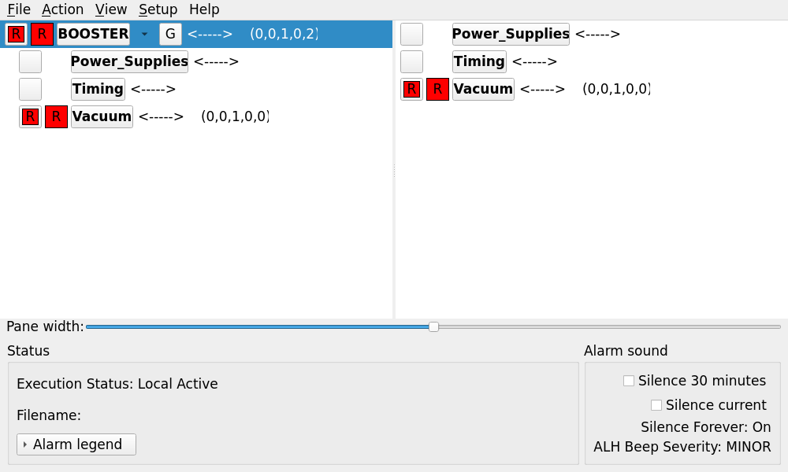

# QtALH user guide

QtALH monitors EPICS Channel Access alarm records and edits legacy `.alhConfig`
files. See the [README](../README.md#build-and-run) for installation and the
[compatibility inventory](qtalh-compatibility.md) for implementation evidence
and differences from Motif ALH. This guide describes the Qt executable;
[the original manual](../alh/documentation/ALH.html) describes legacy ALH.

## First run

Run commands from the repository root after building. The examples use Linux
x86-64; substitute `bin/Darwin-arm64/qtalh` on Apple Silicon or
`bin/Windows-x86_64/qtalh.exe` on Windows.

```sh
bin/Linux-x86_64/qtalh --help
bin/Linux-x86_64/qtalh --version
bin/Linux-x86_64/qtalh --validate examples/minimal.alhConfig
bin/Linux-x86_64/qtalh -c examples/minimal.alhConfig
```

The [starter configuration](../examples/minimal.alhConfig) contains two
placeholder PV names. Use the editor's Properties dialog to replace them with
records from your IOC, then Save As to a new configuration. `qtalh -c` starts
an empty editor. Editing does not start alarm monitoring. File → Activate ALH
opens a separate runtime copy of the current edits; an unnamed document must
first be saved. Later runtime reloads read that saved file.

For a runtime preview:

```sh
bin/Linux-x86_64/qtalh -S -D -s -mainwindow examples/minimal.alhConfig
```

This connects to the configured PV names using your EPICS CA environment.
Unresolved names display ERROR. `--validate` checks parsing only, with no GUI
or CA connections; it does not check PV existence, access rights, audio, or log
permissions. Help, version, and successful validation exit with status 0;
option/configuration errors print to stderr and exit with status 1.

Without `-mainwindow`, runtime starts with a compact facility button. Click it
to open the main tree and group contents. Closing the main runtime window hides
it while monitoring continues. Closing the compact window or using File
Exit/Close asks for confirmation before stopping that runtime.

### Selection and alarm silence

Changing the display filter preserves the selected alarm when it remains visible.
If filtering removes it, the selection clears, selection dialogs close, and
selection-dependent actions stay disabled until you select another visible row.
This also applies when an alarm clears while a filter is active.

Changing **Setup → Silence Time Interval** to a different duration ends any
active timed silence, matching ALH. Enable the silence checkbox again to start
that duration. Choosing the same interval leaves the countdown unchanged.
Timed silence, Silence Current, Silence Forever, interval changes, and timed
silence expiry are recorded in the operation log when file logging is enabled.

### Preview guidance and commands

Hover over a **G** button to read the configured guidance text. A configured URL
or filename is also shown, without fetching its content. Click G or use Ctrl+G
to open the guidance. Hover over **P** to preview the command that clicking it
will launch; menus list each action and command, with `MASTER_ONLY` restrictions
identified. Previews show the effective `qtedm` command when a leading `medm`
executable is substituted. Hovering never opens guidance or executes commands.
These tooltips work with both Motif and modern styles.

## Timed shelving

Select a channel or group and choose **Action → Shelve Alarms…**. Choose 15 or
30 minutes, 1, 4, or 8 hours, or custom whole minutes from 1 to 1,440. The default
is one hour. Enter a single-line reason (1–240 characters); the timer starts
when you click **Shelve**. A group operation shelves its currently unshelved
channels and retains existing shelves' deadlines and reasons. The dialog keeps
its displayed target even if you select another row in the main window.

Shelving affects **only this runtime's display and sound**, including when
running in global or passive mode. Shelved channels do not contribute to active
or unacknowledged alarm counts and are excluded from those display filters.
Unfiltered views mark them **[Shelved]**. Monitoring, count filtering, alarm
logging, command hooks, and severity-output PVs continue normally. Other ALH or
QtALH runtimes are unaffected. Shelving never acknowledges an alarm or changes
its mask, ACKS, or ACKT.

Click **Shelved: N**, or choose **View → Shelved Alarms…**, to see full channel
paths, underlying severity and outstanding acknowledgements, expiration in local
time, remaining duration, and reasons. **Unshelve Selected** restores selected
channels immediately. **Change Shelf…** replaces one channel's deadline and
reason. **Action → Unshelve Alarms** clears all shelves beneath the selected
group, including shelves originally applied individually. Unshelve a channel
before acknowledging it; bulk acknowledgement skips shelved channels.

At expiry, current alarm presentation returns automatically. Outstanding
unacknowledged alarms can sound again, subject to existing thresholds and silence
settings. A latched transient can reappear even if the PV recovered while
shelved. Explicit mask changes and acknowledgement by other clients still apply.
If Disable or Cancel remains set, expiry does not override it. Shelving is
therefore different from **NoAck for One Hour**, which changes acknowledgement
behavior, and **silencing**, which affects sound without removing alarm counts.

Shelves survive successful configuration reloads in the same runtime, retaining
their deadlines and reasons. Matching uses the full hierarchy, not PV names or
row positions alone. Removed, renamed, moved, or ambiguous channels lose their
shelves with an operator-log explanation. Newly added channels start unshelved.
Failed reloads leave shelving unchanged. Local latches for matched shelved
channels survive reload; global acknowledgements are reconciled with fresh IOC
updates.

Shelves are not saved in `.alhConfig` or shared with another runtime. Runtime
Save As leaves existing shelves intact but does not export them. Stopping the
runtime clears them; hiding the main window while its compact window remains
open does not. Deadlines follow the system wall clock, expire on the next engine
tick, and are checked after system suspend. Operator logs record shelving,
changes, early unshelving, expiry, and reload-related removal, unless logging is
disabled.

## Command-line reference

Syntax: `qtalh [OPTIONS] [configfile]`. One configuration is supported per
invocation; the UI can open additional windows. A missing runtime filename
means `ALH-default.alhConfig`. If it does not exist, interactive startup opens
a file chooser. The headless validator instead reports the missing file.
Configuration filenames and `-a`/`-o` arguments beginning with `./` or `../`
resolve against the working directory, overriding `-f`, `-l`, and `ALARMHANDLER`.
Absolute paths also override those directories; bare filenames use them.
INCLUDE paths retain their separate configuration-directory rule.

| Option | Meaning and default |
| --- | --- |
| `-c` | Configuration editor; otherwise runtime monitoring. |
| `-global` | Use IOC ACKS/ACKT fields for global acknowledgement. Default: local acknowledgement. |
| `-S` | Passive mode: suppress CA writes and operator acknowledgement. |
| `-caputackt` | Apply configured transient acknowledgement settings at startup in global active mode. |
| `-D` | Disable alarm and operation **file** logging. Does not disable CA writes or configured helper queues. |
| `-s` | Start with Silence Forever enabled; it can be changed in Setup. |
| `-p file` | Play a local audio file instead of the system beep. Formats depend on the installed Qt Multimedia backend; the suite exercises Ogg/Vorbis. |
| `-f dir` | Configuration and INCLUDE directory. Default: `ALARMHANDLER`, or the working directory (`.`). |
| `-l dir` | Log directory. Default: the configuration directory. Create it before starting. |
| `-a file` | Alarm filename, relative to the log directory unless absolute or explicitly prefixed with `./` or `../`. Default: `ALH-default.alhAlarm`. |
| `-o file` | Operation filename, relative to the log directory unless absolute or explicitly prefixed with `./` or `../`. Default: `ALH-default.alhOpmod`. |
| `-m count` | Alarm retention in records; default 2000, or unlimited with `-L`. An explicit `-m` overrides either default; `0` means unlimited. Does not bound the operation log. |
| `-T` | Append `.yyyy-MM-dd` to each log filename, using local dates. The alarm record limit still applies. |
| `-xml` | Write legacy XML-like entry records; these are not a complete XML document. |
| `-L` | Coordinate master/slave alarm logging with a lock. Alarm retention defaults to unlimited unless `-m` is supplied. |
| `-Lfile basename` | Override the lock basename; requires `-L` to enable locking. Default: resolved configuration filename. |
| `-B` | Enable file-based message, reload, and temporary stop-logging broadcasts. |
| `-P key` | Send alarm records to a printer System V queue; positive decimal integer, Linux/macOS only. |
| `-O key` | Send database records to a System V queue; positive decimal integer, Linux/macOS only. |
| `-filter no\|active\|unack` | Initial display filter; default `no`. Active includes active or unacknowledged alarms. Filtering does not stop monitoring. |
| `-mainwindow` | Open the main runtime window at startup. |
| `-maskcolor` | Color the mask controls. |
| `-noerrorpopup` | Suppress error message boxes; errors still appear in the window message area, Qt diagnostic output, and operation log when logging is enabled. |
| `-desc_field` | Subscribe to each channel record's `.DESC` field for descriptions. |
| `-debug` | Timestamped startup, alarm, CA, command, logging, and broadcast diagnostics on stderr. Default: off. |
| `-display display`, `--display display` | Set `DISPLAY` before opening the GUI (for X11). |
| `-geometry geometry` | Initial geometry of the compact runtime window, or the main window with `-mainwindow` or `-c`. Accepts dimensions and/or position, such as `1000x600+20+20` or `-20-20`; negative offsets measure from the available screen’s right/bottom edges. |
| `-fn font`, `-font font` | Runtime button font; defaults to `ALHMAINFONT` when set. XLFD fonts are approximated. |
| `-platform platform` | Qt platform selection, for example `offscreen` or `xcb`. |
| `-style name`, `-style=name` | Appearance: `motif` (default), `fusion`, or an installed Qt Widgets style. Names are case-insensitive; the last occurrence wins. |
| `-help`, `--help`, `-h` | Print help without opening a display. |
| `-version`, `--version`, `-v` | Print ALH, Qt, and EPICS version information without opening a display. |
| `--validate` | Parse the configuration and includes, report group/channel counts, then exit. |
| `--` | End options before the configuration filename. |

### Choosing an appearance

Launch with `qtalh -style fusion -mainwindow facility.alhConfig` for a modern
interface, or `qtalh -c -style fusion facility.alhConfig` for the styled editor.
Omit `-style`, or use `-style motif`, to retain the original Motif-influenced
appearance. Selection applies to this process, including runtime windows opened
from the editor; it is not saved in the alarm configuration or user preferences.

Fusion uses the system palette and fonts, standard controls, two alarm panes,
grouped status/sound controls, and an expandable alarm legend. Properties uses
General, Force PV, Commands, and Guidance tabs. Styled file choosers use Qt's
standard dialog and match the chosen style. Alarm colors, acknowledgement,
blinking, masks, and action behavior retain their meanings. Apply, Cancel, and
Reset retain their existing behavior; modeless dismiss buttons are labeled Close.

Other styles depend on the Qt installation and operating system. Unknown names
produce an error listing available styles before any PV connections are made.
Help, version, and configuration validation do not require a display and do not
check style availability. `QT_STYLE_OVERRIDE` alone does not enable the modern
interface. `-fn`/`-font` and `ALHMAINFONT` continue to affect only the compact
runtime button. There is no separate light/dark switch; available system palette
integration depends on the Qt version and desktop.

Styled fonts default to one point smaller than the system font sizes (with a
minimum of 6 points). An explicitly configured runtime-button font keeps its
requested size. With any explicit style other than Motif, **Ctrl+-** decreases the font size,
**Ctrl++** (or **Ctrl+=**) increases it, and **Ctrl+0** restores the startup size.
Use **Command** instead of Ctrl on macOS. Each press changes the size by one
point, with a UI range of 6–72 points. Changes apply throughout the process,
including open dialogs and newly opened windows; monospace text and custom
runtime-button fonts retain their families. Font sizes are not saved between
launches. Bare `+` and `-` continue to expand and collapse the alarm tree.
These font shortcuts are disabled in Motif mode.



See [appearance details and screenshots](qtalh-appearance.md) for the dialog
layouts and legacy comparison.

Local mode keeps acknowledgements in this runtime. Global active mode can write
ACKS/ACKT and configured acknowledgement, severity, and heartbeat PVs. Passive
mode still monitors alarms and can log them. It does not disable configured
shell commands; `-D` and `-s` also leave command execution enabled.

EPICS Base reads the standard `EPICS_CA_*` environment variables.
`QT_QPA_PLATFORM` selects Qt's display backend; `QT_PLUGIN_PATH` can locate
plugins from a separate SDK. On Windows, `COMSPEC` selects the command shell
(default `cmd.exe`). Sound paths and an explicit relative `-Lfile` basename
resolve from the process working directory, rather than `-f` or `-l`.
Unknown switches and arbitrary Xt resource overrides are errors. CDEV and
CMLOG extensions are not supported by QtALH.

## Configuration format

Declarations and directive names are case-sensitive. Blank lines and lines
starting with `#` are ignored. Names and declaration filenames are whitespace
separated tokens; quoting does not allow spaces in those fields. Directive
text such as aliases, commands, and guidance can contain spaces.

```text
GROUP NULL Facility
GROUP Facility Vacuum
CHANNEL Vacuum example:pressure -----
$ALIAS Vacuum pressure
$BEEPSEVR MAJOR
$GUIDANCE
Check the vacuum controller before acknowledging this alarm.
$END
```

Exactly one root group is required. A parent must be the current group or one
of its ancestors (for a channel, lookup starts at its parent), so arrange the
file in tree order. A group cannot be named `NULL` or repeat an ancestor's name;
repeated group names in separate branches are allowed. Group nesting is limited
to 50 levels.

`CHANNEL parent pv [mask]` defaults to `-----`. Masks are sets of uppercase
letters and save in canonical `CDATL` positions; short/reordered forms such as
`D` and `DA` are accepted.

| Letter | Setting |
| --- | --- |
| `C` | Cancel: stop the channel's alarm subscription. |
| `D` | Disable: exclude the alarm from active group severity, history, commands, and audible indication; monitoring continues unless also cancelled. |
| `A` | NoAck: exclude the channel from acknowledgement requirements. |
| `T` | NoAckT: do not retain cleared transient alarms for acknowledgement. In global mode this corresponds to IOC ACKT being zero. |
| `L` | NoLog: suppress this channel's alarm records. |

Disable alone does not suppress alarm-file records; use NoLog for that. Timed
NoAck is an operator setting and displays `H` in the mask summary.

`INCLUDE parent filename` attaches another file beneath the named parent.
Every relative include, including nested includes, resolves against `-f` or
`ALARMHANDLER` (default `.`), not the containing include's directory. For example,
use `qtalh -f /path/to/configs main.alhConfig`. Absolute paths are accepted.
Within an included file, each `GROUP NULL` attaches beneath the current group,
matching ALH; after a channel, that means its parent group. Include cycles and
excessive nesting are errors. The C++ `loadConfig` API uses
the top-level file's directory when no configuration directory is supplied.

Directives normally apply to the preceding group/channel:

| Directive | Arguments and behavior |
| --- | --- |
| `$ALIAS` | Display label text; the underlying PV/group name is unchanged. |
| `$GUIDANCE` | URL or filename, opened externally. Relative guidance files resolve from the document directory. With no inline value, read text through `$END` into a guidance dialog. Multiple inline blocks on a node are combined in order. |
| `$COMMAND` | Related command, or `label ! command ! label ! command` menu pairs. Commands starting with `medm` (including a quoted or absolute executable path) silently launch `qtedm` from `PATH` instead, preserving arguments. Configuration text is unchanged. This substitution also applies to severity/status commands. |
| `$BEEPSEVERITY` | Facility beep threshold (default MINOR); may occur before the root. |
| `$BEEPSEVR` | Threshold for the current node; ancestor thresholds also apply. The last directive on a node wins. |
| `$HEARTBEATPV` | `pv [interval_seconds [short_integer_value]]`; defaults 1 second and value 1. The first heartbeat in the facility, including includes, wins. Writes require global active mode. |
| `$ACKPV` | `pv short_integer_value`; channel only. Written on global active acknowledgement. |
| `$SEVRPV` | Output PV for the node's severity (0–4); disabled channels publish -1. Writes require global active mode. `-` leaves the output unset; the first real PV replaces earlier `-` placeholders and takes precedence over later directives. |
| `$FORCEPV` | `pv mask [force_value [reset_value]]`; default force 1, reset 0. At force, apply the mask; at reset, restore configured channel masks. `NE` or a reset equal to force resets on leaving the force value. Applies to descendant channels for a group. |
| `$FORCEPV_CALC` | EPICS CALC expression required when the FORCEPV name is `CALC`. |
| `$FORCEPV_CALC_A` through `$FORCEPV_CALC_F` | Numeric constants or PV inputs for CALC. Unspecified inputs default to zero; all named PV inputs must become available before evaluation. |
| `$SEVRCOMMAND` | `UP_severity command` or `DOWN_severity command`, matching direction and destination severity; `ANY` matches any change in that direction, `UP_ALARM` matches leaving NO_ALARM. Channel startup is evaluated from ERROR, matching ALH. Repeat to add commands. |
| `$STATCOMMAND` | `status command`; channel only, runs when entering that status. Repeat to add commands. Status names follow EPICS alarm names and the additional connection/access states in `qtalh/core/model.cc`. |
| `$ALARMCOUNTFILTER` | `count seconds`; channel only. Omitted count and seconds each default to 1. Legacy alarm count/time filtering: count -1 delays alarm onset, 0 also holds clearing transitions, positive counts track repeated alarm edges within the interval. Zero seconds disables filtering. Accepted count range: -1 through 1,000,000; seconds must be a nonnegative integer. |

Fixed-argument directives accept trailing comments beginning with a
whitespace-separated `#`, for example `$SEVRPV output # severity mirror`.
Hashes within PV names remain part of the name. Commands, aliases, and guidance
retain their complete text. `$FORCEPV_CALC A > 0 # beam inhibit` also accepts a
trailing comment. A valid complete CALC expression takes precedence, preserving
the `#` not-equal operator in expressions such as `A # B`.

Scalar Force PV values compare at double precision; CALC force/reset values
compare at float precision. For `NE` (or reset equal to force), Qt consistently
uses float precision to recognize the previous forced CALC value before resetting.
This intentionally fixes an ALH inconsistency that could leave a force mask applied
after a rounded match. For example, force 16777216 with CALC results
16777217 then 16777220 applies and then resets the mask.

With `-global -caputackt`, if a PV occurs more than once with different configured
T bits, ALH's startup order decides the final setting: subgroups first, then direct
channels within each group; the last occurrence in that traversal wins. Cancelled
channels participate. Qt sends the final setting once per PV when writable.

Severities are `NO_ALARM`, `MINOR`, `MAJOR`, `INVALID`, and `ERROR` (0–4).
Severity values also accept numbers and case-insensitive names; command direction
prefixes `UP_` and `DOWN_` are uppercase. Heartbeat intervals must be finite,
positive, and no greater than 2147483.647 seconds; scheduling rounds to milliseconds
with a 1 ms minimum. Event-loop delays can delay a beat; missed beats are skipped.
Heartbeat writes and the precise timer pause while the PV is disconnected or
unwritable. One diagnostic is reported per outage. The ordinary refresh checks
availability and resumes the timer within about 200 ms after CA reports recovery.
In global mode, communication failures have a separate local ERROR acknowledgement.
They remain audible and visible in the unacknowledged filter. Acknowledging that
error does not write to the IOC or ACKPV; any outstanding IOC alarm remains pending.
The error latch survives recovery when transient acknowledgement is enabled, or
clears on recovery with NoAckT. Failed IOC acknowledgement submissions are logged
as failures and do not trigger ACKPV or acknowledgement-success records.

Severity and heartbeat outputs use the legacy short-integer CA type; ACKPV uses
the legacy unsigned-enum type. This also preserves integer text on string PVs.

Commands use `/bin/sh -c` on Linux/macOS and `cmd.exe /d /s /c` on Windows.
Use commands appropriate to the host. A leading `MASTER_ONLY` restricts a
command to the logging master. Stop-logging broadcasts also temporarily suppress
commands. The editor does not execute runtime alarm commands.

Open/insert failures leave the current document intact. Save uses an atomic
file replacement, expands includes, normalizes masks, orders channels before
child groups, and discards comments and original formatting. Runtime Save As
exports masks without changing the original configuration's reload, lock, or
broadcast identity; editor Save As changes the document filename.

## Logging and shared operation

Create a writable log directory and select it explicitly when desired:

```sh
mkdir -p logs
bin/Linux-x86_64/qtalh -l logs -a alarm.log -o operation.log -m 2000 -L my.alhConfig
```

Replace `my.alhConfig` with your configuration. Without `-L`, alarm logs retain the
most recent 2000 records by default using a circular file. With `-L`, they append
without a record limit, matching ALH. An explicit `-m` overrides either default;
the example above opts into 2000 records. Physical line order after wrapping is
not chronological. Operation logs append without a record limit. Their facility prefix uses the
root group's alias, or its name if no alias is set, and follows alias changes on
reload. Database headers retain the underlying facility identifier. Dated logs
route each alarm by its event's local date, so delayed alarms crossing midnight
remain searchable on their original date. Operation logs use the current date.
Earlier daily files are kept; automatic deletion is not implemented. Historical browsers search the current file and dated
siblings, sort by time, and support local From/To times and case-sensitive With
text across complete records, including legacy continuation lines. For circular logs, a checkpoint matching the complete file preserves
insertion order among equal timestamps, including when results are limited.
Without a matching checkpoint, equal timestamps retain physical file order. They report cancellation, unreadable files, and the 100,000-record/10 MiB
result limits. Live viewers and the ten-entry in-memory alarm history are separate.

Runtime errors are appended to the operation log when logging is enabled and
the destination is writable. Failure to audit an error still leaves it visible
in the message area and diagnostic output without recursively logging failures.

Startup log-open failures appear in the message area and error dialog (unless
`-noerrorpopup` is set). Failed destinations are retried on subsequent records
and every two seconds; repeated identical open errors are reported once.
Recovery preserves the other log and resumes recording new events. Events missed
while a destination was unavailable are not replayed.

**View → Alarm Log File** and **Operation Log File** show a live tail limited to
1,000 records or 256 KiB. They follow destination changes and the current local
date with `-T`. File reads run in the background; unchanged append-only files are
not reread in full. The alarm viewer uses a valid checkpoint to display wrapped
records in insertion order, including equal timestamps. Without a matching
checkpoint, a snapshot scans all physical slots and retains the newest timestamps
before applying the display limits. Equal timestamps retain physical order. Use
the historical browser for older records.

Bounded alarm logs keep a sibling `.qtalh-position.<identity>` file containing two
binary checkpoints. The identity suffix keeps a renamed log and its replacement
from sharing a checkpoint. A locator stored on the log preserves checkpoint lookup
across renames on filesystems supporting extended attributes or NTFS streams;
keep the checkpoint at that location. Existing `.qtalh-position` files remain
readable and are upgraded on the next write. If it is missing or does not match, recovery
uses timestamps, which cannot reliably order ties or out-of-order records.
Records are flushed before checkpoint updates; the two files are separate writes
and are not an atomic transaction or a per-record durable fsync. New alarms arriving
during a large recovery scan are spooled in order. If the snapshot changes or
cannot be read, recovery retries without consuming the pending alarm. An unreadable
or incomplete spool is also retained, with a diagnostic identifying its path and
first unread byte; only fully consumed spools are removed. Closing a window makes a
bounded synchronous retry; if recovery still fails, a diagnostic
identifies the retained temporary spool, the first unread byte, and its target log.
This spool requires manual recovery: from that byte, each entry is an 8-byte header
(two big-endian unsigned 32-bit values: retention limit and record byte length)
followed by the record bytes. See the
[checkpoint details](qtalh-logging-analysis.md#implemented-changes).

`-L` uses `<configuration>.LOCK` by default and checks ownership at startup and
about every 20 seconds. It selects the alarm writer; operation records remain
per-process. Multiple independent processes sharing a circular alarm file should
use the same lock basename and logging settings. `-Lfile /path/to/shared` selects
`/path/to/shared.LOCK`. On Linux/macOS, locks use the legacy POSIX format; Windows
uses native file locks without POSIX interoperability.

`-B` uses `<configuration>.MESS` and `.MESSLOCK`, independently of `-Lfile`.
Participants must use the same configuration identity and have access to those
files. Pending startup messages and reload requests are delivered after the window
installs its handlers. Messages are polled every two seconds, and senders hold delivery ownership
for 60 seconds; another send reports busy during that interval. Broadcast actions
send a message, reload the named configuration, or suppress alarm logging and
commands for 1–10 minutes. Monitoring continues. Reload preserves Silence Forever.

Linux/macOS helpers retain these positional arguments:

```text
qtalh_printer host tcp_port queue_key bw|bw_bold|oki_bold|hp_color
qtalh_DB      host rpc_program_number queue_key
```

The printer helper reports connection/write failures on stderr, retains the current
record, and retries after one second. Connections or writes with no progress time
out after ten seconds. Each outage is reported once, followed by a message when
delivery resumes.

Keys must match `-P`/`-O`. The database argument is an RPC program number,
version 1/procedure 1, rather than a TCP port. Native System V queue layout is
ABI-dependent. Mixed legacy/Qt records are limited to `250 - sizeof(long)` text
bytes (242 on 64-bit Linux); oversized queue records report errors without
preventing file logging. Windows does not build these helpers and rejects
`-P`/`-O`.

## Troubleshooting

| Symptom | Check |
| --- | --- |
| EPICS headers/libraries not found | Build Base first; set `EPICS_BASE` and `EPICS_HOST_ARCH` to that installation. See [build discovery](../README.md#linux-and-macos). |
| Qt modules or build tools missing | Install matching Widgets, Network, PrintSupport, and Multimedia development files; tests also need Qt Test. Use `QT_VERSION=5` or `6` consistently and matching `moc`/`rcc`. |
| Cannot open a display | Use the native GUI session or a working X11 display. Use `--validate` for a headless syntax check; test targets supply offscreen mode where appropriate. |
| Channel remains ERROR | Verify the PV name, IOC availability, CA address environment, and read access. `-debug -noerrorpopup` exposes connection/access diagnostics on stderr. |
| Acknowledgement or output PV does not change | Check local/global/passive mode and IOC write access. Failed acknowledgements remain visible; manual ACKT changes require an explicit retry. |
| Cannot open logs or lock files | Create the parent directory and check permissions on the selected files and checkpoint sidecar. A failed log destination change preserves the current destination. |
| Sound fails | Check the audio path, Qt Multimedia plugins/backend, output device, Silence Forever, and beep threshold. Muted fixture playback verifies decoding, not speaker output. |
| Helper or visual tests fail | Check the [test prerequisites](../qtalh/tests/README.md); missing rpcbind, legacy executables, softIoc, or X11 are failures, not skipped coverage. |

For developer orientation, `qtalh/core/` contains parsing and alarm state,
`qtalh/services/` contains CA/logging/options/protocols, and `qtalh/ui/` contains
models, dialogs, and windows. Core depends on Qt Core and EPICS calculation
routines, but not Widgets or CA. The service interfaces and clock/command/log
callbacks support deterministic core tests. Preserve the original license and
source provenance when modifying the port.

## Personal notifications and escalation

**Setup → Notifications…** adds personal email/sendmail and generic JSON webhook
subscriptions, scope/PV matching, delayed stages, repeat suppression, optional
resolution messages, preview, explicit synthetic test submission, and delivery
activity. Each runtime starts paused; select **Enable notifications in this runtime**.
Subscriptions operate independently in local/global/passive modes and never write
alarm PVs. Shelving and Cancel/Disable/NoAck suppress notifications; silence does not.
Settings are saved atomically in the per-user Qt configuration directory, separate
from ALH files. See the [notification guide](site/operate/notifications.md) for setup,
reload behavior, delivery guarantees, retry rules, and limits.

## Session alarm analytics

**View → Alarm Analytics…** provides frequent-offender rankings, configurable
chatter detection, standing-alarm durations, confirmed acknowledgement response
times, charts, and CSV export. Collection starts automatically in each runtime
and remains in memory. Session summaries survive same-configuration reloads;
rolling history is bounded and reports disclose gaps and partial coverage.
See the [analytics guide](site/operate/analytics.md) for metric definitions,
suppression behavior, acknowledgement confirmation, and export details.
